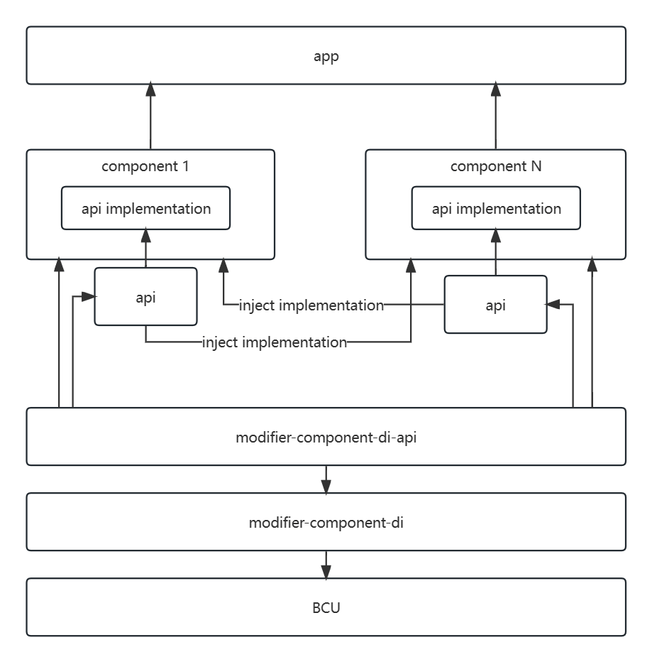

## modifier-component-di

用于实现组件化的，组件接口注入实例的字节码修改器。

- 如果本项目对你有所帮助，欢迎 start。
- 如果有问题或 bug 欢迎提 issues 给我。


### Foreword

目前大多数流行的组件化通信方式几乎都采用字符串协议通信，在这种方案下，组件间的通信会变成几乎完全隐式的调用方式。在双方只通过字符协议进行通信时，大量常量字符串将会随着项目的膨胀而越来越难管理和维护。并且复杂的协议解析逻辑也将提升使用成本和调试成本。

如果你不想再维护大量难以理清的字符协议，不想去理解庞大且复杂的组件化库，只想以纯接口的方式实现组件间互相调用或通信，那就使用本库吧！

本库的核心的思想是，组件间调用都只依赖所需组件对外的 api 模块，而组件的具体实现只在 app 模块被依赖，这样分层即可确保组件的实现层不会对其它组件暴露，也能够实现组件间的互相调用。



### Compile

工程结构如下

- `app` 用于演示
- `demo1` 用于演示子组件
- `buildSrc` 管理 maven 发布和版本控制项目统一配置
- `repos` 本地 maven 仓库，便于开发时调试
- `lib_modifier_component_di` 本项目核心 Modifier 实现
  - `component_di-api` 上层需要使用的 api

在编译本项目前请先在根目录下执行 `gradlew publishAllPublicationsToLocalRepository` 然后重新 sync。


### Quick Start

1. 推荐使用下面所示的最新版本：

   - BCU：[](https://jitpack.io/#Ysj001/BytecodeUtil)
   - modifier-component-di：[](https://jitpack.io/#Ysj001/bcu-modifier-component-di)

2. 在项目的根 `build.gradle.kts` 中配置如下

   ```kotlin
   // Top-level build file
   buildscript {
       repositories {
           maven { setUrl("https://jitpack.io") }
       }
       
       dependencies {
           // BCU 插件依赖
           classpath("com.github.Ysj001.BytecodeUtil:plugin:<lastest-version>")
           // modifier-component-di 依赖
           classpath("com.github.Ysj001.bcu-modifier-component-di:modifier-component-di:<lastest-version>")
       }
   }
   
   subprojects {
       repositories {
           maven { url 'https://jitpack.io' }
       }
   }
   ```

3. 在 `app` 模块的 `build.gradle.kts` 中的配置如下

   ```kotlin
   plugins {
       id("com.android.application")
       id("org.jetbrains.kotlin.android")
       // 添加 bcu 插件
       id("bcu-plugin")
   }
   
   // 配置 bcu 插件
   bcu {
       config { variant ->
           loggerLevel = 2
           modifiers = arrayOf(
           	// 使用 modifier-component-di 的 Modifier 实现
           	Class.forName("com.ysj.lib.bcu.modifier.component.di.ComponentDIModifier"),
           )
       }
       filterNot { variant, entryName ->
           // 请按需配置过滤，可大幅提升编译输速度
           false
       }
   }
   
   dependencies {
       // 依赖 modifier-component-di-api
   	implementation("com.github.Ysj001.bcu-modifier-component-di:modifier-component-di-api:<lastest-version>")
   }
   
   ```


### API

建议直接查看 demo 工程，具体如下：

- [使用 @Component 标记组件对外接口](demo1/demo1-api/src/main/java/com/example/module/demo1/api/Demo1Component.kt)

- [使用 @ComponentImpl 标记组件接口的唯一实现类](demo1/src/main/java/com/example/module/demo1/Demo1ComponentImpl.kt)

- [使用 @ComponentInject 标记需要注入实例的 field](app/src/main/java/com/ysj/demo/component/MainActivity.kt)

